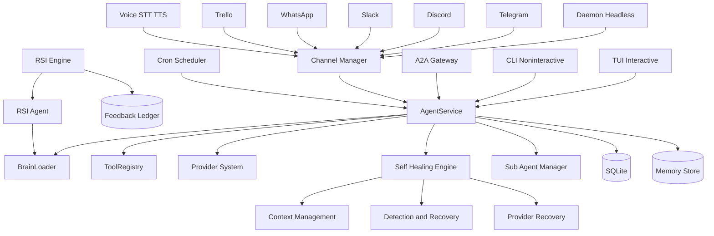
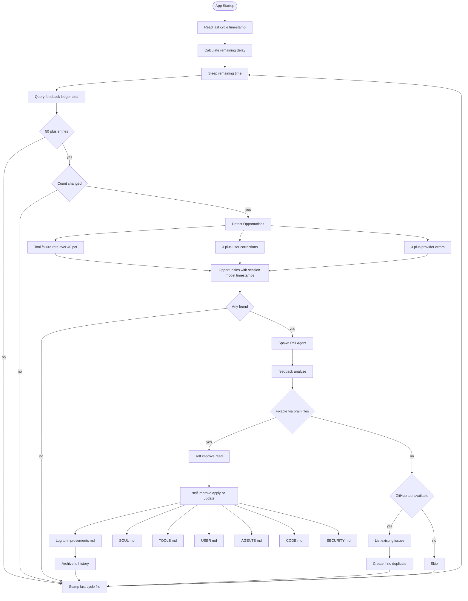
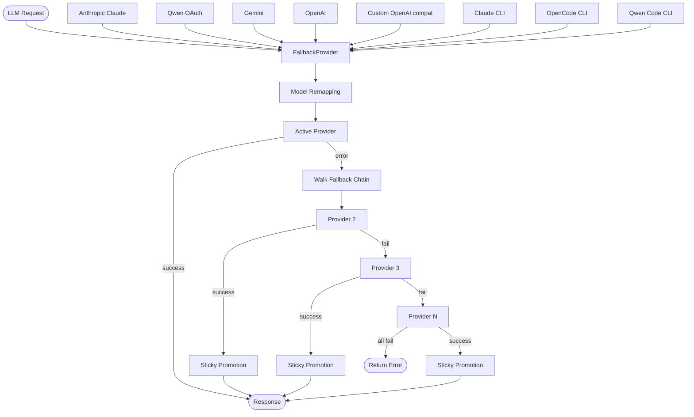
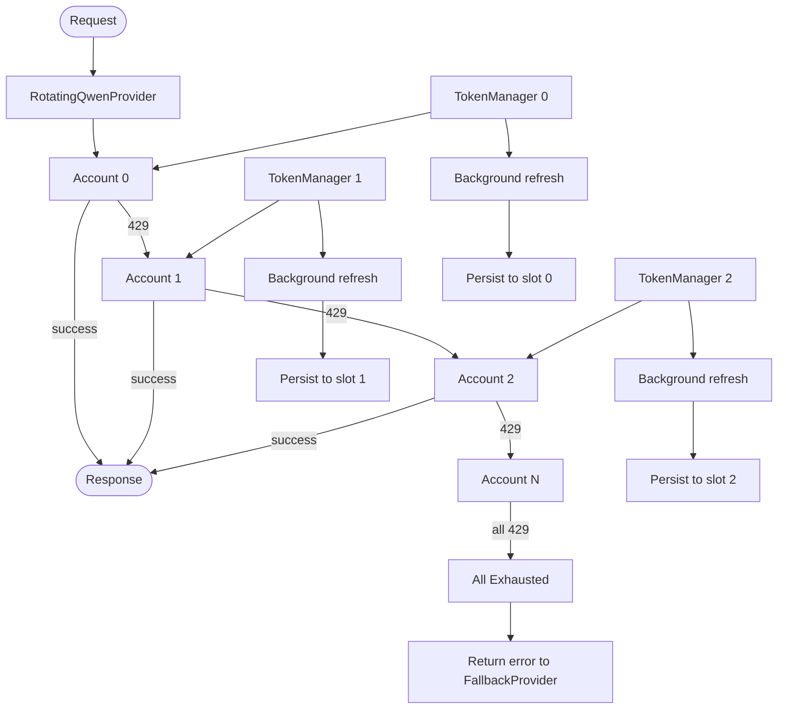
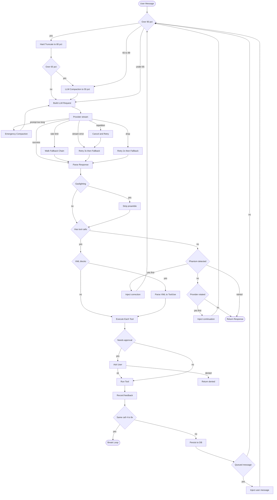
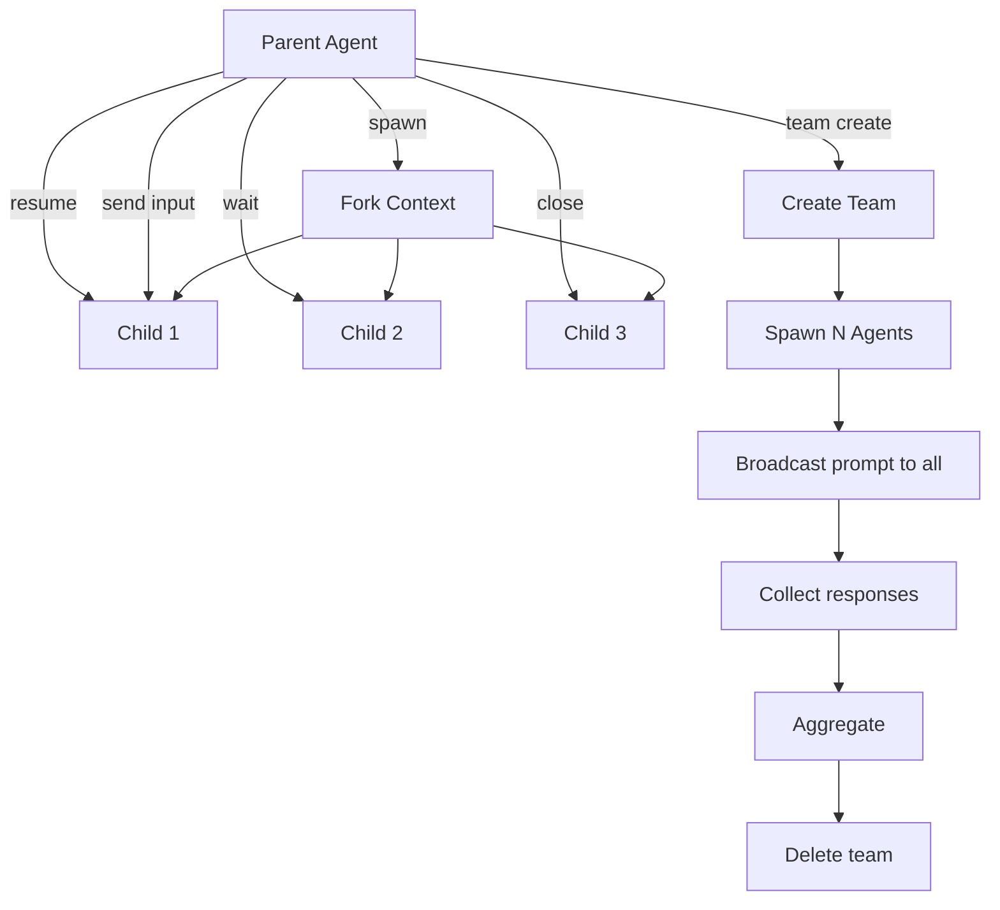
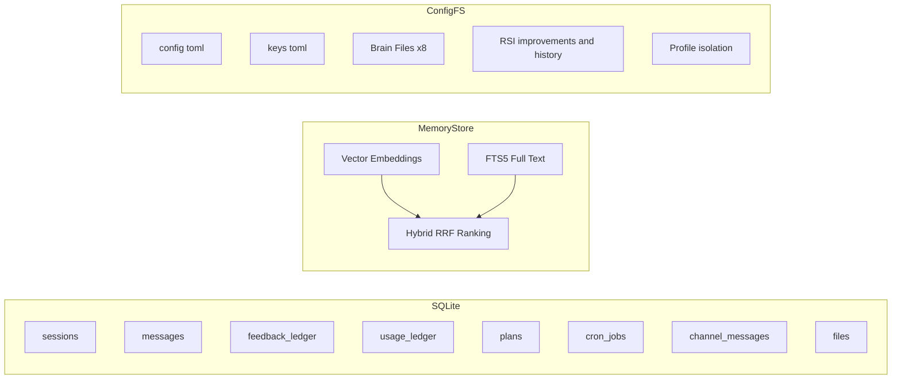
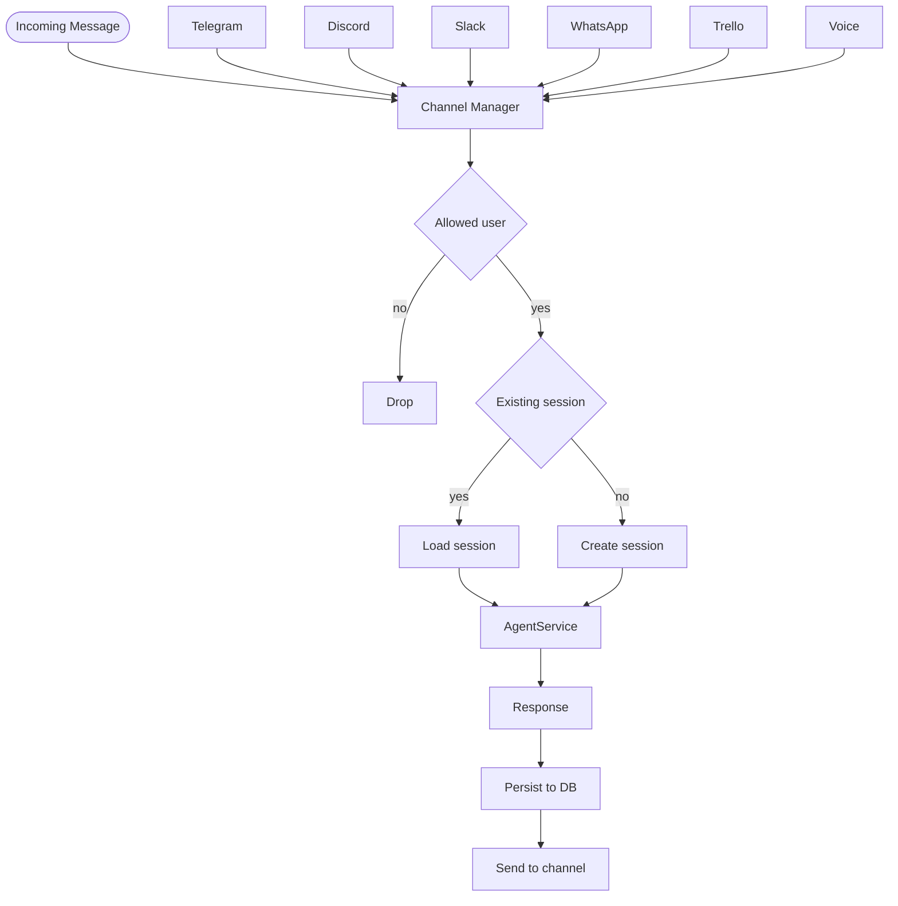
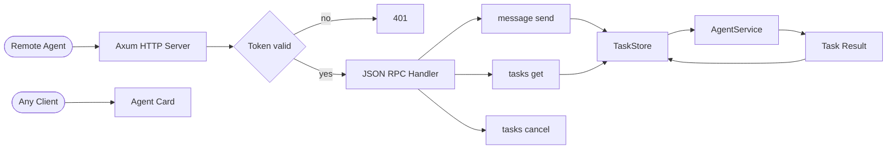

# OpenCrabs System Architecture

## 1. High-Level Overview



## 2. Self Healing Engine

```mermai22d
flowchart TB
    AGENT[AgentService Tool Loop] --> CTX[Context Management]
    AGENT --> DET[Detection]
    AGENT --> PROV[Provider Recovery]
    AGENT --> PERSIST[Persistence]
    CTX --> SOFT[Soft Compaction at 65 pct]
    SOFT --> KEEP[LLM summarizes to 55 pct]
    CTX --> HARD[Hard Truncation at 90 pct]
    HARD --> DROP[Drop oldest to 80 pct]
    DROP --> SOFT
    CTX --> EMERG[Emergency Compaction]
    EMERG --> PRETRUNC[Pre truncate to 85 pct]
    PRETRUNC --> SOFT
    CTX --> CALIB[Token Calibration from provider]
    CTX --> MARKER[Compaction Marker Recovery]
    DET --> PHANTOM[Phantom Tool Detection]
    PHANTOM --> CORRECTION[Inject correction and retry]
    DET --> GASLIGHT[Gaslighting Preamble Strip]
    GASLIGHT --> STRIPPARA[Strip leading paragraphs]
    DET --> REPET[Text Repetition Detection]
    REPET --> CANCELSTREAM[Cancel stream and retry]
    DET --> LOOPDET[Tool Loop Detection]
    LOOPDET --> BREAKLOOP[Break after 4 to 8 repeats]
    DET --> USERCORR[User Correction Detection]
    USERCORR --> RECORDFB[Record to feedback ledger]
    DET --> XMLRECOV[XML Tool Call Recovery]
    XMLRECOV --> SYNTH[Synthesize ToolUse blocks]
    DET --> HTMLSTRIP[HTML Comment Stripping]
    PROV --> RATELIMIT[Rate Limit Handler]
    RATELIMIT --> WALKCHAIN[Walk fallback chain]
    PROV --> STREAMERR[Stream Error Handler]
    STREAMERR --> RETRY3[Retry 3x with backoff]
    RETRY3 --> WALKCHAIN
    PROV --> STREAMDROP[Stream Drop Handler]
    STREAMDROP --> DROPRETRY[Retry 2x then fallback]
    PROV --> ROTCONT[Rotation Continuation]
    ROTCONT --> INJECTCONT[Inject continuation prompt]
    PROV --> SWAPEVENT[Sticky Fallback Swap]
    SWAPEVENT --> NOTIFY[SwapEvent to TUI]
    PERSIST --> ATOMIC[Atomic Message Writes]
    PERSIST --> CRASHTRACK[Crash Recovery Tracking]
    PERSIST --> QUEUED[Queued Message Injection]
    PERSIST --> SESSMODEL[Session Model Fallback]
    PERSIST --> MARKERSTRIP[LLM Artifact Stripping]
```

## 3. RSI Recursive Self Improvement



## 4. Provider System and Fallback Chain



## 5. Qwen OAuth Rotation



## 6. Tool Loop



## 7. Sub Agents and Teams



## 8. Data Layer



## 9. Channel Integration



## 10. A2A Protocol


